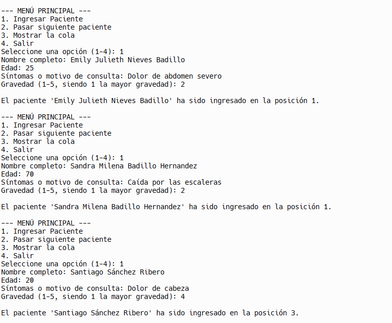
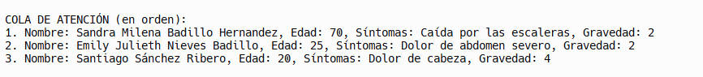
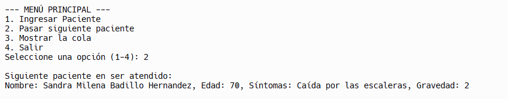

# Cola de Prioridad con Listas Enlazadas en Python

### Estudiante: Emily Julieth Nieves Badillo

Este proyecto implementa una **cola de prioridad** para un sistema de atención médica domiciliaria, cumpliendo con las siguientes indicaciones:

1. **Organizar a los pacientes según la gravedad** (escala 1 a 5, donde 1 es la mayor gravedad).
2. En caso de empatar la gravedad, se asigna la prioridad según la edad, con la siguiente clasificación:
    - **Niños (<12 años)** → subprioridad 1
    - **Adultos mayores (≥65 años)** → subprioridad 2
    - **Demás pacientes** → subprioridad 3
3. La implementación se realiza usando **Listas Enlazadas**, **Clases** y **Objetos** en Python.
4. Incluye un **menú interactivo** con las operaciones:
    - Ingresar Paciente
    - Pasar al siguiente paciente
    - Mostrar la cola
    - Salir

## Estructura del Proyecto

-   `Node`: Clase que representa a cada paciente como un nodo de la lista enlazada.
-   `PriorityQueue`: Clase que maneja la cola de prioridad, con métodos para:
    -   **Insertar** pacientes en la posición correcta según la prioridad.
    -   **Pasar** al siguiente paciente (el primero de la cola).
    -   **Mostrar** la cola de pacientes en orden.
-   `main()`: Función principal con el menú de opciones.

### Cómo se asigna la prioridad

-   Primero se **ordena por la gravedad** (número más bajo = más urgente).
-   Si hay empate en la gravedad, se verifica la **subprioridad** (1 < 2 < 3).

De esta forma, siempre se atenderán primero los pacientes más graves y, en igualdad de condiciones, se atenderán primero a los niños, luego a los adultos mayores y, por último, a los demás.

## Ejecución de la Aplicación

La consola presenta un menú con 4 opciones:

1. **Ingresar Paciente**  
   Solicita los datos básicos (nombre, edad, síntomas, gravedad) e inserta el paciente en la cola. Luego, muestra la posición en que queda.

2. **Pasar siguiente paciente**  
   Muestra y retira al primer paciente en la cola, es decir, quien tenga la mayor prioridad.

3. **Mostrar la cola**  
   Muestra los pacientes en orden de atención.

4. **Salir**  
   Termina la aplicación.

## Pantallazos de Ejemplo

A continuación se muestran capturas de la consola para ilustrar el funcionamiento. (Reemplaza las rutas de imagen con la ubicación que uses en tu repositorio.)

1. **Menú Principal**  
   

2. **Ingreso de Pacientes**  
   

3. **Mostrando la Cola**  
   

4. **Pasar Siguiente Paciente**  
   

> **Nota**: En estos ejemplos se demuestra la inserción de varios pacientes, incluyendo casos con la misma gravedad pero diferente edad, para validar la prioridad según subprioridad.
